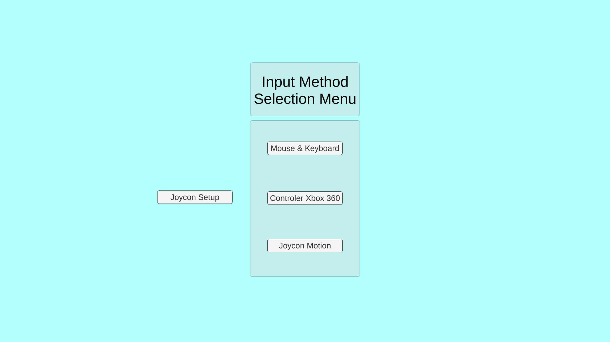
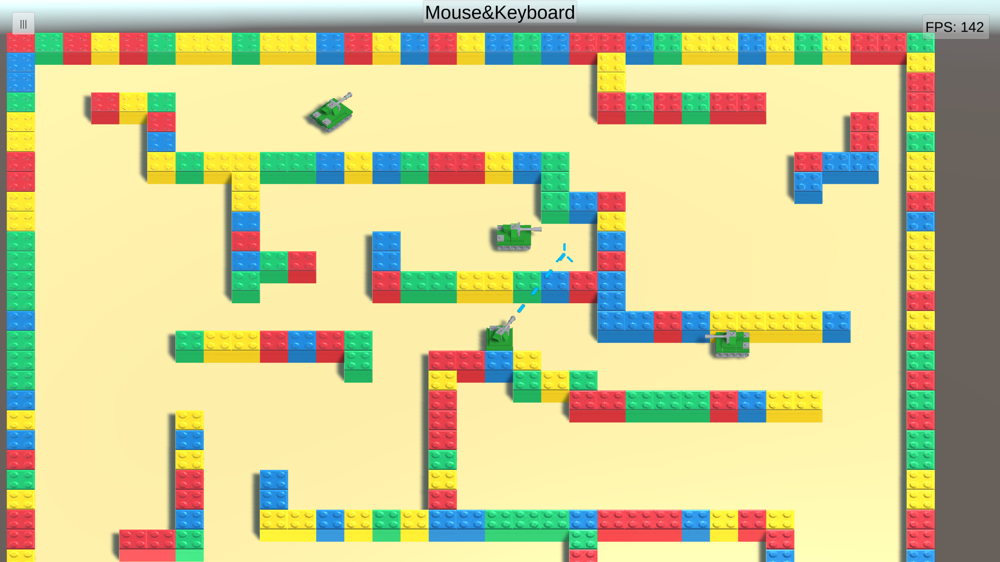

# TankMania-InputMethodSurvey

## Introduction 

This project as part of the course ”3D User Interfaces” aims to test various control
schemes for the top-down tank-game ”TankMania” developed during this semester’s
Computer Games Laboratory. The player is given control of a small tank which is able
to move, aim and shoot in a given scene. For these three simple performable actions,
this project is intended to find a control scheme which is most preferred by players while
making use of different input devices. This is done by a user study evaluating which
control scheme performs best in the eyes of the players who are asked to rank their
preferences. The result and analysis of survey can be found in [here](Docs/Analysis%20of%206%20Input%20Methods%20for%20TankMania!.pptx).

## Control Schemes

A set of control schemes for various controller devices has been developed: Namely,
schemes involving Keyboard & Mouse, Gamepad (Xbox™Controller), Nintendo Switch
Joycons™ and Mobile Touch Screen were used. While even more control schemes than
presented were implemented, some were cut to make the survey evaluation feasible.
The three mobile schemes involved a controller-like, drag-to-aim as well as a directed
auto-shoot version.

## Screenshot

Here are some Screenshots taken in Desktop Build.

## Members

Janosch Landvogt
Chang Luo
Mykola Morozov
Raoul Zebisch

## License
MIT License

